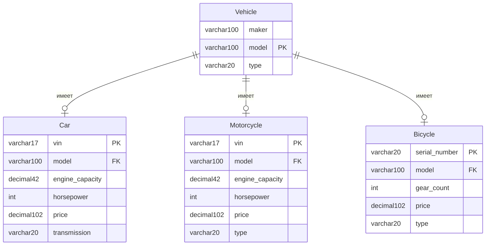

# Описание

Для запуска проекта нужно создать таблицы и заполнить их данными из файла `work1/createAndInsert.sql`

## Задача 1

### Условие

> Найдите производителей (maker) и модели всех мотоциклов, которые имеют мощность более 150 лошадиных сил, стоят менее 20 тысяч долларов и являются спортивными (тип Sport). Также отсортируйте результаты по мощности в порядке убывания.

### Решение

`SELECT maker, motorcycle.model FROM`motorcycle`JOIN`vehicle`ON motorcycle.model = vehicle.model WHERE horsepower > 150`

#### 1. Что выводим

`SELECT maker, motorcycle.model`

- maker — производитель (из таблицы vehicle)
- motorcycle.model — модель мотоцикла (из таблицы motorcycle)

#### 2. Откуда берем данные

`` FROM `motorcycle` ``

- Главная таблица — motorcycle

#### 3. Соединяем через INNER JOIN

``JOIN `vehicle` ON motorcycle.model = vehicle.model``

- Тип JOIN: INNER JOIN (сокращенно JOIN)
- Условие: motorcycle.model = vehicle.model
- Смысл: берем только те записи, где модель мотоцикла существует в таблице vehicle

#### 4. Фильтрация

`WHERE horsepower > 150`

- Оставляем только мотоциклы с мощностью больше 150 л.с.

## Задача 2

### Условие

> Найти информацию о производителях и моделях различных типов транспортных средств (автомобили, мотоциклы и велосипеды), которые соответствуют заданным критериям.

### Автомобили: Извлечь данные о всех автомобилях, которые имеют:

Мощность двигателя более 150 лошадиных сил.
Объем двигателя менее 3 литров.
Цену менее 35 тысяч долларов.
В выводе должны быть указаны производитель (maker), номер модели (model), мощность (horsepower), объем двигателя (engine_capacity) и тип транспортного средства, который будет обозначен как Car.

### Мотоциклы: Извлечь данные о всех мотоциклах, которые имеют:

Мощность двигателя более 150 лошадиных сил.
Объем двигателя менее 1,5 литров.
Цену менее 20 тысяч долларов.
В выводе должны быть указаны производитель (maker), номер модели (model), мощность (horsepower), объем двигателя (engine_capacity) и тип транспортного средства, который будет обозначен как Motorcycle.

### Велосипеды: Извлечь данные обо всех велосипедах, которые имеют:

Количество передач больше 18.
Цену менее 4 тысяч долларов.
В выводе должны быть указаны производитель (maker), номер модели (model), а также NULL для мощности и объема двигателя, так как эти характеристики не применимы для велосипедов. Тип транспортного средства будет обозначен как Bicycle.

### Сортировка:

Результаты должны быть объединены в один набор данных и отсортированы по мощности в порядке убывания. Для велосипедов, у которых нет значения мощности, они будут располагаться внизу списка.

### Решение

``SELECT
v.maker, v.model, c.horsepower, c.engine_capacity, v.type
FROM
`car`c JOIN`vehicle` v ON c.model = v.model
WHERE
horsepower > 150 AND engine_capacity < 3.0 AND price < 35000``

`UNION`

``SELECT
v.maker, v.model, m.horsepower, m.engine_capacity, v.type
FROM
`motorcycle` m JOIN `vehicle` v ON m.model = v.model
WHERE
horsepower > 150 AND engine_capacity < 1.5 AND price < 20000``

`UNION`

``SELECT
v.maker, v.model, NULL AS horsepower, NULL AS engine_capacity, v.type
FROM
`bicycle` b JOIN `vehicle` v ON b.model = v.model
WHERE
gear_count > 18 AND price < 4000``

`ORDER BY ISNULL(horsepower), horsepower DESC`

#### Общее описание всех трёх частей

- SELECT - выбирает 5 колонок: производитель, модель, мощность, объём двигателя, тип ТС
- JOIN vehicle - подтягивает производителя (maker) и тип ТС из общей таблицы
- WHERE - фильтрует по специфическим критериям для каждого типа ТС
- UNION - объединяет результаты трёх запросов в один набор, удаляя дубликаты

#### Сортировка

`ORDER BY ISNULL(horsepower), horsepower DESC`

- ORDER BY - метод для сортировки
- ISNULL(horsepower) - возвращает запросы, которые не равны NULL по полю `horsepower`, затем запросы у которых в поле `horsepower` NULL
- horsepower DESC - сортирует по убыванию значений в колонке horsepower

## Схема связей (ER-диаграмма)

