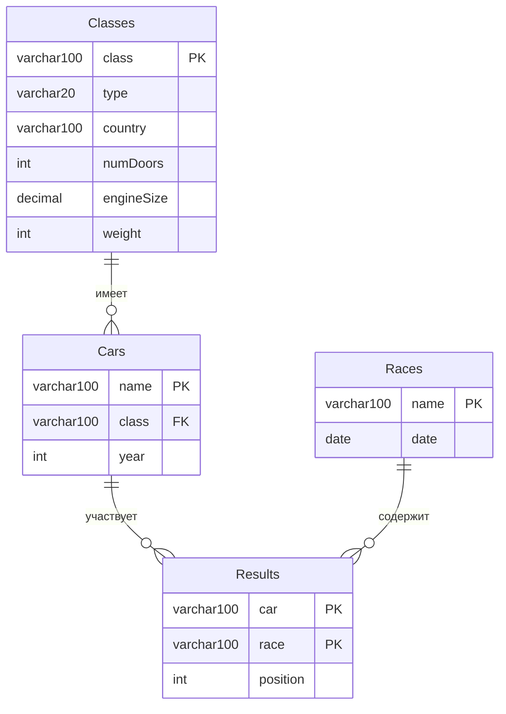

# Описание

Для запуска проекта нужно создать таблицы и заполнить их данными из файла `work2/createAndInsert.sql`

## Задача 1

### Условие

> Определить, какие автомобили из каждого класса имеют наименьшую среднюю позицию в гонках, и вывести информацию о каждом таком автомобиле для данного класса, включая его класс, среднюю позицию и количество гонок, в которых он участвовал. Также отсортировать результаты по средней позиции.

### Решение

#### 1. `car_avg_positions` — для каждого автомобиля считает:

- `avg_position` — среднюю позицию во всех гонках

- `race_count` — количество участий в гонках

#### 2. `min_avg_per_class` — для каждого класса находит лучшую (минимальную) среднюю позицию среди всех его автомобилей

#### 3. `Финальный SELECT` — соединяет обе таблицы и оставляет только те автомобили, чья средняя позиция равна лучшей в своём классе

#### 4. `DROP TEMPORARY TABLE` — удаляет временные таблицы после использования

## Задача 2

### Условие

> Определить автомобиль, который имеет наименьшую среднюю позицию в гонках среди всех автомобилей, и вывести информацию об этом автомобиле, включая его класс, среднюю позицию, количество гонок, в которых он участвовал, и страну производства класса автомобиля. Если несколько автомобилей имеют одинаковую наименьшую среднюю позицию, выбрать один из них по алфавиту (по имени автомобиля).

### Решение

#### 1. `JOIN Classes` — добавляет информацию о стране производства класса автомобиля

#### 2. `AVG(r.position)` — вычисляет среднюю позицию автомобиля в гонках

#### 3. `COUNT(r.race)` — считает количество гонок, в которых участвовал автомобиль

#### 4. `ORDER BY avg_position ASC, c.name ASC` — сортирует сначала по средней позиции (от лучшей к худшей), затем по имени автомобиля по алфавиту

#### 5. `LIMIT 1` — выбирает только первую запись (с наилучшей средней позицией)

## Задача 3

### Условие

> Определить классы автомобилей, которые имеют наименьшую среднюю позицию в гонках, и вывести информацию о каждом автомобиле из этих классов, включая его имя, среднюю позицию, количество гонок, в которых он участвовал, страну производства класса автомобиля, а также общее количество гонок, в которых участвовали автомобили этих классов. Если несколько классов имеют одинаковую среднюю позицию, выбрать все из них.

### Решение

#### 1. `car_avg` — средняя позиция и количество гонок для каждого автомобиля

#### 2. `class_avg` — средняя позиция для каждого класса (на основе средних позиций автомобилей)

#### 3. `min_class_avg` — наименьшая средняя позиция среди всех классов

#### 4. `best_classes` — классы, имеющие наименьшую среднюю позицию

#### 5. `class_total_races` — общее количество гонок для всех автомобилей каждого класса

#### 6. `Финальный запрос` — выводит все автомобили из лучших классов с требуемой информацией

## Задача 4

### Условие

> Определить, какие автомобили имеют среднюю позицию лучше (меньше) средней позиции всех автомобилей в своем классе (то есть автомобилей в классе должно быть минимум два, чтобы выбрать один из них). Вывести информацию об этих автомобилях, включая их имя, класс, среднюю позицию, количество гонок, в которых они участвовали, и страну производства класса автомобиля. Также отсортировать результаты по классу и затем по средней позиции в порядке возрастания.

### Решение

#### 1. `car_avg` — вычисляет среднюю позицию и количество гонок для каждого автомобиля

#### 2. `class_stats` — вычисляет:

- `class_avg_position` — среднюю позицию всех автомобилей в классе

- `car_count` — количество автомобилей в классе

#### 3. Условия отбора:

- `car_count >= 2` — только классы, где минимум 2 автомобиля

- `avg_position < class_avg_position` — средняя позиция автомобиля лучше (меньше) средней по классу

`JOIN Classes` — добавляет страну производства

`ORDER BY` — сортирует по классу и средней позиции

## Задача 5

### Условие

> Определить, какие классы автомобилей имеют наибольшее количество автомобилей с низкой средней позицией (больше 3.0) и вывести информацию о каждом автомобиле из этих классов, включая его имя, класс, среднюю позицию, количество гонок, в которых он участвовал, страну производства класса автомобиля, а также общее количество гонок для каждого класса. Отсортировать результаты по количеству автомобилей с низкой средней позицией.

### Решение

#### 1. `low_avg_cars` - автомобили, у которых средняя позиция в гонках хуже 3.0 (то есть 4, 5, 6 и т.д.)

#### 2. `low_cars_count` - сколько таких "плохих" автомобилей в каждом классе

#### 3. `max_low_count` - одно число: максимальное количество "плохих" автомобилей среди всех классов

#### 4. `best_classes` - классы-лидеры по количеству "плохих" автомобилей (те, у которых это количество равно максимальному)

#### 5. `class_total_races` - общее количество гонок, в которых участвовали все автомобили класса (сумма по всем машинам класса)

#### 6. `Финальный SELECT` - собирает всю информацию о "плохих" автомобилях только из классов-лидеров

## Схема связей (ER-диаграмма)

