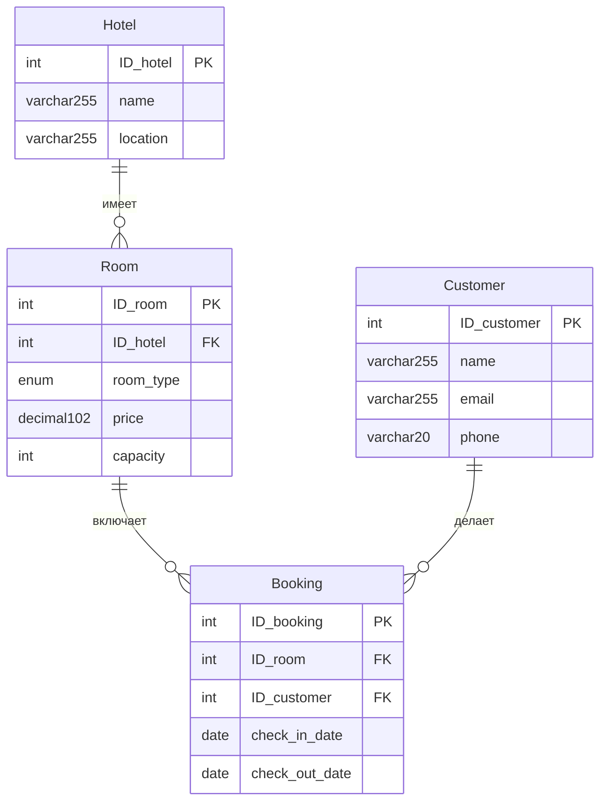

# Описание

Для запуска проекта нужно создать таблицы и заполнить их данными из файла `work3/createAndInsert.sql`

## Задача 1

### Условие

> Определить, какие клиенты сделали более двух бронирований в разных отелях, и вывести информацию о каждом таком клиенте, включая его имя, электронную почту, телефон, общее количество бронирований, а также список отелей, в которых они бронировали номера (объединенные в одно поле через запятую). Также подсчитать среднюю длительность их пребывания (в днях) по всем бронированиям. Отсортировать результаты по количеству бронирований в порядке убывания.

### Пояснение к решению

#### 1. `COUNT(b.ID_booking)` - Общее количество бронирований клиента
#### 2. `GROUP_CONCAT(DISTINCT h.name ORDER BY h.name SEPARATOR ', ')` - Список уникальных отелей, где бронировал клиент, объединённых через запятую
#### 3. `ROUND(AVG(DATEDIFF(...)), 4)` - Средняя длительность пребывания в днях, округлённая до 4 знаков
#### 4. `COUNT(DISTINCT r.ID_hotel) > 1` - Клиент бронировал номера минимум в двух разных отелях
#### 5. `COUNT(b.ID_booking) > 2` - Клиент сделал более двух бронирований (минимум 3)

## Задача 2

### Условие

> Необходимо провести анализ клиентов, которые сделали более двух бронирований в разных отелях и потратили более 500 долларов на свои бронирования. Для этого:

> - Определить клиентов, которые сделали более двух бронирований и забронировали номера в более чем одном отеле. Вывести для каждого такого клиента следующие данные: ID_customer, имя, общее количество бронирований, общее количество уникальных отелей, в которых они бронировали номера, и общую сумму, потраченную на бронирования.

> - Также определить клиентов, которые потратили более 500 долларов на бронирования, и вывести для них ID_customer, имя, общую сумму, потраченную на бронирования, и общее количество бронирований.

> - В результате объединить данные из первых двух пунктов, чтобы получить список клиентов, которые соответствуют условиям обоих запросов. Отобразить поля: ID_customer, имя, общее количество бронирований, общую сумму, потраченную на бронирования, и общее количество уникальных отелей.

> - Результаты отсортировать по общей сумме, потраченной клиентами, в порядке возрастания.

### Пояснение к решению

#### 1. `FROM и JOIN` - Создаётся временная таблица, где каждая строка - одно бронирование с полной информацией.
#### 2. `GROUP BY c.ID_customer, c.name` - Все строки, принадлежащие одному клиенту, собираются в одну группу.
#### 3. `COUNT(b.ID_booking) > 2`	- Более двух бронирований
#### 4. `COUNT(DISTINCT r.ID_hotel) > 1` - Бронирования в разных отелях (минимум 2)
#### 5. `SUM(r.price) > 500` - Общая сумма трат более 500 долларов
#### 6. `HAVING` - Отбираются только те группы (клиенты), которые удовлетворяют ВСЕМ трём условиям
#### 7. `ORDER BY total_spent ASC` - Отсортированные строки по возрастанию суммы трат

## Задача 3

### Условие

> Необходимо провести анализ данных о бронированиях в отелях и определить предпочтения клиентов по типу отелей. Для этого выполните следующие шаги:

> 1.Категоризация отелей.
Определите категорию каждого отеля на основе средней стоимости номера:

> - «Дешевый»: средняя стоимость менее 175 долларов.
> - «Средний»: средняя стоимость от 175 до 300 долларов.
> - «Дорогой»: средняя стоимость более 300 долларов.

> 2.Анализ предпочтений клиентов.
Для каждого клиента определите предпочитаемый тип отеля на основании условия ниже:

> - Если у клиента есть хотя бы один «дорогой» отель, присвойте ему категорию «дорогой».
> - Если у клиента нет «дорогих» отелей, но есть хотя бы один «средний», присвойте ему категорию «средний».
> - Если у клиента нет «дорогих» и «средних» отелей, но есть «дешевые», присвойте ему категорию предпочитаемых отелей «дешевый».

> 3.Вывод информации.
Выведите для каждого клиента следующую информацию:

> - ID_customer: уникальный идентификатор клиента.
> - name: имя клиента.
> - preferred_hotel_type: предпочитаемый тип отеля.
> - visited_hotels: список уникальных отелей, которые посетил клиент.

> 4.Сортировка результатов.
Отсортируйте клиентов так, чтобы сначала шли клиенты с «дешевыми» отелями, затем со «средними» и в конце — с «дорогими».

### Пояснение к решению

#### 1. `hotel_category` - Для каждого отеля вычисляет среднюю стоимость номера (по всем номерам этого отеля) и на основе этого присваивает категорию.
#### 2. `customer_hotel_categories` - Для каждого клиента собирает список уникальных отелей (с их категориями), которые он посетил.
#### 3. `Финальный SELECT`:
- Определяет предпочитаемый тип по приоритету (Дорогой > Средний > Дешевый)
- Собирает список отелей в одну строку через GROUP_CONCAT
- Сортирует по категории (Дешевый → Средний → Дорогой)

## Схема связей (ER-диаграмма)

