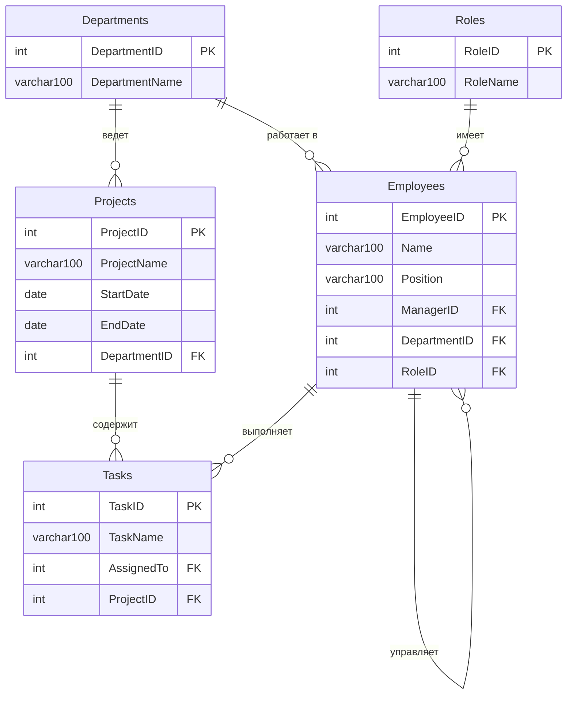

# Описание

Для запуска проекта нужно создать таблицы и заполнить их данными из файла `work4/createAndInsert.sql`

## Задача 1

### Условие

> Найти всех сотрудников, подчиняющихся Ивану Иванову (с EmployeeID = 1), включая их подчиненных и подчиненных подчиненных, а также самого Ивана Иванова. Для каждого сотрудника вывести следующую информацию:

> 1. EmployeeID: идентификатор сотрудника.
> 2. Имя сотрудника.
> 3. ManagerID: Идентификатор менеджера.
> 4. Название отдела, к которому он принадлежит.
> 5. Название роли, которую он занимает.
> 6. Название проектов, к которым он относится (если есть, конкатенированные в одном столбце через запятую).
> 7. Название задач, назначенных этому сотруднику (если есть, конкатенированные в одном столбце через запятую).
> 8. Если у сотрудника нет назначенных проектов или задач, отобразить NULL.

> Требования:

> - Рекурсивно извлечь всех подчиненных сотрудников Ивана Иванова и их подчиненных.
> - Для каждого сотрудника отобразить информацию из всех таблиц.
> - Результаты должны быть отсортированы по имени сотрудника.
> - Решение задачи должно представлять из себя один sql-запрос и задействовать ключевое слово RECURSIVE.

### Пояснение к решению

#### 1. `Рекурсивный CTE` - Строит иерархическое дерево всех сотрудников, подчиняющихся Ивану Иванову (EmployeeID = 1), включая его самого.
#### 2. `SELECT с LEFT JOIN` - Присоединяет к иерархии сотрудников справочные данные и собирает связанные проекты и задачи.
#### 3. `GROUP BY` - Группирует строки по каждому сотруднику, чтобы агрегатные функции (GROUP_CONCAT, COUNT и др.) могли свернуть несколько значений в одно.
#### 4. `GROUP_CONCAT` - Превращает несколько строк с проектами/задачами в одну строку, где значения разделены запятыми.
#### 5. `ORDER BY` - Сортирует финальный результат по имени сотрудника в алфавитном порядке.

## Задача 2

### Условие

> Найти всех сотрудников, подчиняющихся Ивану Иванову с EmployeeID = 1, включая их подчиненных и подчиненных подчиненных, а также самого Ивана Иванова. Для каждого сотрудника вывести следующую информацию:

> 1. EmployeeID: идентификатор сотрудника.
> 2. Имя сотрудника.
> 3. Идентификатор менеджера.
> 4. Название отдела, к которому он принадлежит.
> 5. Название роли, которую он занимает.
> 6. Название проектов, к которым он относится (если есть, конкатенированные в одном столбце).
> 7. Название задач, назначенных этому сотруднику (если есть, конкатенированные в одном столбце).
> 8. Общее количество задач, назначенных этому сотруднику.
> 9. Общее количество подчиненных у каждого сотрудника (не включая подчиненных их подчиненных).
> 10. Если у сотрудника нет назначенных проектов или задач, отобразить NULL.

### Пояснение к решению

#### 1. `Рекурсивный CTE` - Строит иерархическое дерево всех сотрудников, подчиняющихся Ивану Иванову (EmployeeID = 1), включая его самого и подчинённых любой глубины.
#### 2. `Основной SELECT с JOIN` - Присоединить справочные данные и вычислить агрегатную информацию для каждого сотрудника.
#### 3. `Подсчёт TotalTasks` - Подсчитать общее количество задач, назначенных сотруднику.
#### 4. `Подсчёт TotalSubordinates` - Подсчитать количество прямых подчинённых у каждого сотрудника (без учёта подчинённых подчинённых).
#### 5. `GROUP BY` - Сгруппировать строки по каждому сотруднику, чтобы агрегатные функции (GROUP_CONCAT, COUNT) могли корректно свернуть несколько значений в одно.
#### 6. `ORDER BY` - Отсортировать финальный результат по имени сотрудника в алфавитном порядке.

## Задача 3

### Условие

> Найти всех сотрудников, которые занимают роль менеджера и имеют подчиненных (то есть число подчиненных больше 0). Для каждого такого сотрудника вывести следующую информацию:

> 1. EmployeeID: идентификатор сотрудника.
> 2. Имя сотрудника.
> 3. Идентификатор менеджера.
> 4. Название отдела, к которому он принадлежит.
> 5. Название роли, которую он занимает.
> 6. Название проектов, к которым он относится (если есть, конкатенированные в одном столбце).
> 7. Название задач, назначенных этому сотруднику (если есть, конкатенированные в одном столбце).
> 8. Общее количество подчиненных у каждого сотрудника (включая их подчиненных).
> 9. Если у сотрудника нет назначенных проектов или задач, отобразить NULL.

### Пояснение к решению

#### 1. `Рекурсивный CTE` - Построить полное иерархическое дерево всех сотрудников организации (не только подчинённых Ивана Иванова).
#### 2. `SubordinateCount` - Для каждого менеджера подсчитать общее количество подчинённых (включая подчинённых подчинённых).
#### 3. `SELECT с JOIN и фильтрацией` - Выбрать всех менеджеров, у которых есть подчинённые, и вывести полную информацию.
#### 4. `Фильтрация (WHERE)` - Если у сотрудника нет подчинённых, в SubordinateCount нет записи, и при LEFT JOIN будет NULL. COALESCE превращает NULL в 0, чтобы условие > 0 работало корректно.
#### 5. `GROUP BY` - Группировка по каждому сотруднику для корректной работы GROUP_CONCAT.
#### 6. `GROUP_CONCAT` - Объединить несколько проектов/задач в одну строку через запятую.
#### 7. `ORDER BY` - Сортировка результата по идентификатору сотрудника в порядке возрастания.

## Схема связей (ER-диаграмма)

